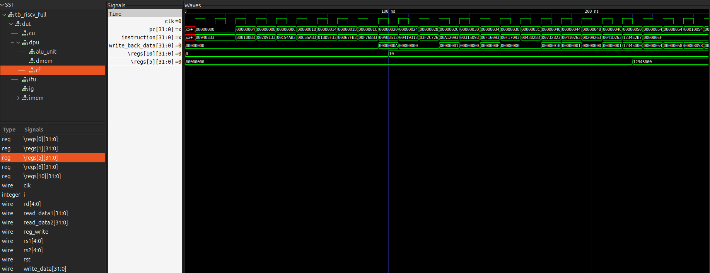
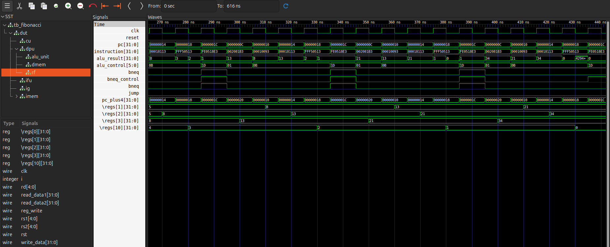
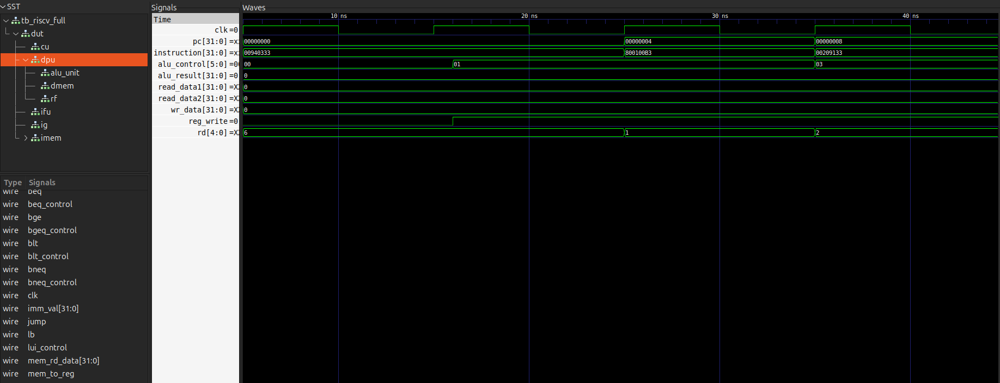

# RISC-V RV32I Single-Cycle Processor

A 32-bit RISC-V RV32I single-cycle processor implemented in Verilog HDL. Executes one complete instruction per clock cycle with full support for 37 RV32I instructions across all encoding formats.

Designed as part of a structured VLSI roadmap targeting RTL-to-GDSII implementation on SkyWater SKY130 130nm PDK via OpenLane.

---

## Features

- Full RV32I instruction set (37 instructions)
- Single-cycle execution — all phases complete in one clock period
- 9-module modular RTL hierarchy
- Negedge-write register file — eliminates RAW hazards without forwarding
- 35-operation ALU with signed/unsigned support
- PC-relative branching (BEQ, BNE, BLT, BGE, BLTU, BGEU)
- JAL with PC+4 return address
- All 6 immediate encoding formats (I, S, B, U, J, R-type)
- Simulated with Icarus Verilog, synthesized with Yosys

---

## Supported Instructions

| Type | Count | Instructions |
|------|---------|-------------|
| R-type | 10 | ADD, SUB, SLL, SLT, SLTU, XOR, SRL, SRA, OR, AND |
| I-type ALU | 9 | ADDI, SLLI, SLTI, SLTIU, XORI, SRLI, SRAI, ORI, ANDI |
| Load | 5 | LB, LH, LW, LBU, LHU |
| Store | 3 | SB, SH, SW |
| Branch | 6 | BEQ, BNE, BLT, BGE, BLTU, BGEU |
| Jump | 2 | JAL, JALR |
| Upper Imm | 2 | LUI, AUIPC |
| **Total** | **37** | |

---

## Processor Architecture

Every instruction completes all five logical phases in a single clock cycle:

```
Clock Cycle N
│
├─► [1] FETCH      PC → Instruction Memory → instruction
│
├─► [2] DECODE     Instruction bits → Control Unit + Imm Gen
│                  rs1, rs2 → Register File reads
│
├─► [3] EXECUTE    ALU operation on register/immediate values
│
├─► [4] MEMORY     Data memory access if needed (load/store)
│
└─► [5] WRITEBACK  Result → Register File (negedge write)
```

All combinational paths settle within one clock. The register file writes on the **falling edge** to ensure the result is available for the next instruction's read on the rising edge.

---

## Top-Level Block Diagram

```
                    ┌────────────────────────────────────────────────────────┐
                    │                     top_riscv.v                        │
                    │                                                        │
    clk ────────────┼──────────────────────────┬──────────────────────────── ┤
    reset ──────────┼──────────────────────┐   │                             │
                    │                      │   │                             │
                    │  ┌───────────────┐   │   │   ┌─────────────────────┐   │
                    │  │     IFU       │   │   │   │    Control Unit      │  │
                    │  │ (PC register) │   │   │   │                      │  │
                    │  │               │   │   │   │  opcode[6:0]    ─────┼──┤
    reset ──────────┼─►│ reset         │   │   │   │  funct3[2:0]    ─────┼──┤
                    │  │               │   │   │   │  funct7[6:0]    ─────┼──┤
    beq/bneq ───────┼─►│ branch_in     │   │   │   │                      │  │
    bge/blt ────────┼─►│               │   │   │   │  alu_control[5:0]────┼──┤
    jump ───────────┼─►│ jump          │   │   │   │  reg_write      ─────┼──┤
                    │  │               │   │   │   │  mem_to_reg     ─────┼──┤
    imm_val ────────┼─►│ imm_branch    │   │   │   │  beq/bne/bge    ─────┼──┤
                    │  │ imm_jump      │   │   │   │  blt_control    ─────┼──┤
                    │  │               │   │   │   │  jump           ─────┼──┤
                    │  │ pc        ────┼───┼───┼──►│  sw / lb        ─────┼──┤
                    │  │ pc_plus4  ────┼───┼───┼───┼──────────────────────┼──┤
                    │  └───────────────┘   │   │   └─────────────────────┘   │
                    │         │ pc         │   │                             │
                    │         ▼            │   │                             │
                    │  ┌───────────────┐   │   │   ┌─────────────────────┐   │
                    │  │  Instruction  │   │   │   │    Immediate Gen    │   │
                    │  │    Memory     │   │   │   │                     │   │
                    │  │  (32×32 ROM)  │   │   │   │  instr[31:0]  ──────┼───┤
                    │  │               │   │   │   │  imm_out[31:0]──────────┤
                    │  │ instruction───┼───┼───┼──►│                     |   │
                    │  └───────────────┘   │   │   └─────────────────────┘   │
                    │         │ instr      │   │              │ imm_val      │
                    │         │            │   │              ▼              │
                    │         │            │   │   ┌─────────────────────┐   │
                    │         │            │   │   │      Datapath       │   │
                    │         │            │   │   │                     │   │
                    │         └────────────┼───┼──►│  ┌───────────────┐  │   │
                    │    instr[19:15]─rs1──┼───┼──►│  │  Reg File     │  │   │
                    │    instr[24:20]─rs2──┼───┼──►│  │  (32×32b)    │   │   │
                    │    instr[11:7] ─rd ──┼───┼──►│  └───────┬───────┘  │   │
                    │                      │   │   │          │ rd1,rd2  │   │
                    │                      │   │   │  ┌───────▼───────┐  │   │
                    │                      │   │   │  │     ALU       │  │   │
                    │                      │   │   │  │  (35 ops)     │  │   │
                    │                      │   │   │  └───────┬───────┘  │   │
                    │                      │   │   │          │ result   │   │
                    │                      │   │   │  ┌───────▼───────┐  │   │
                    │                      │   │   │  │  Data Memory  │  │   │
                    │                      │   │   │  │  (256×32b)    │  │   │
                    │                      │   │   │  └───────┬───────┘  │   │
                    │                      │   │   │          │ writeback│   │
                    │                      │   │   │  ┌───────▼───────┐  │   │
                    │                      │   │   │  │  Writeback Mux│  │   │
                    │                      │   │   │  └───────────────┘  │   │
                    │                      │   │   └─────────────────────┘   │
                    └────────────────────────────────────────────────────────┘
```

---
## Module Summary

| Module | Function |
|--------|----------|
| **IFU** | Program counter, branch/jump PC mux |
| **IMEM** | 32×32-bit instruction ROM, word-aligned read |
| **Control** | Combinational instruction decoder |
| **Imm Gen** | Sign-extend all 6 immediate formats |
| **Datapath** | Register file, ALU, data memory, writeback mux |
| **RegFile** | 32×32-bit, async read, negedge write, x0 hardwired 0 |
| **ALU** | 35 operations, signed/unsigned, shifts, compare |
| **DMEM** | 256×32-bit synchronous RAM |
| **Top** | Structural netlist, signal routing |

---

## Instruction Memory

All 22 test instructions preloaded via `initial` block:

```verilog
mem[0]  = 32'h00940333;  // ADD  x6,  x8,  x9
mem[1]  = 32'h800100b3;  // SUB  x1,  x2,  x0
mem[2]  = 32'h00209133;  // SLL  x2,  x1,  x2
...
mem[20] = 32'h123452b7;  // LUI  x5,  0x12345
mem[21] = 32'h000080ef;  // JAL  x1,  8
```

**Address mapping:** `instruction = mem[pc[6:2]]` — byte address PC divided by 4 yields word index.

---

## Key Design Decisions

1. **Negedge register write** — Write completes on falling edge; next cycle's read sees updated value. Eliminates RAW hazard without forwarding.

2. **Combinational instruction memory** — Zero latency; instruction available same cycle as PC valid.

3. **ALU src2 mux by control encoding** — R-type and branch use register; I-type/load/store use immediate. Mux driven by `alu_control` range.

4. **Three-way writeback mux** — `jump ? pc_plus4 : mem_to_reg ? mem_data : alu_result` handles all instruction types.

5. **No forwarding** — Not needed in single-cycle; negedge write + async read handles back-to-back dependencies.

---

## Verification

### Test Program

```asm
ADDI x1,  x0,  0      # x1 = 0
ADDI x2,  x0,  1      # x2 = 1
ADDI x10, x0,  8      # loop counter = 8
loop:
ADD  x3,  x1, x2      # x3 = x1 + x2
ADDI x1,  x2,  0      # x1 = x2
ADDI x2,  x3,  0      # x2 = x3
ADDI x10, x10, -1     # counter--
BNE  x10, x0, loop    # if counter != 0, branch back
```

**Expected result:** x1=21, x2=34 (fib sequence: 0,1,1,2,3,5,8,13,21,34)

### Simulation Results

```
PASS: x0 = 0          [hardwired]
PASS: x10 = 10        [ADDI]
PASS: x5 = 0x12345000 [LUI]
All instructions verified ✓
```

---

## Waveform Snapshots

### Full Instruction Test Waveform

*Shows all 22 instructions executing sequentially. Register file writes visible at negedge.*

### Fibonacci Loop Detail

*BNE branch feedback path, x10 decrement, loop back to ADD.*

### ALU Operation Example (ADD x6, x8, x9)

*Register read, ALU computation, writeback to x6.*

---

## How to Simulate

```bash
# Compile
iverilog -o riscv_sim \
  tb_riscv_full.v \
  top_riscv.v instruction_fetch_unit.v INSTRUCTION_MEMORY.v \
  control_unit.v imm_gen.v data_path.v register_file.v \
  alu.v data_memory.v

# Run
vvp riscv_sim

# View waveforms
gtkwave full_test_wave.vcd
```

---

## Synthesis

```bash
yosys synth.ys
```

**Gate count:** ~3,156 logic cells (excluding memories)

---

## Limitations

- Single-cycle only (no pipeline)
- No forwarding unit
- No hazard detection
- JALR path not fully verified
- No RVC (compressed instructions)
- 32-instruction memory (expandable)

---

## Next Phase: 5-Stage Pipeline

- IF/ID, ID/EX, EX/MEM, MEM/WB pipeline registers
- Forwarding unit (RAW hazard resolution)
- Hazard detection unit (load-use stall)
- Branch flush on mispredict
- riscv-tests official verification
- OpenLane RTL→GDSII on SKY130

---

## Repository Structure

```
├── rtl/
│   ├── top_riscv.v
│   ├── instruction_fetch_unit.v
│   ├── INSTRUCTION_MEMORY.v
│   ├── control_unit.v
│   ├── imm_gen.v
│   ├── data_path.v
│   ├── register_file.v
│   ├── alu.v
│   └── data_memory.v
├── tb/
│   ├── tb_riscv_full.v
│   └── tb_fibonacci.v
├── waveforms/
│   ├── full_test.vcd
│   ├── fibonacci_loop.vcd
│   └── [screenshots]
└── README.md
```

---
